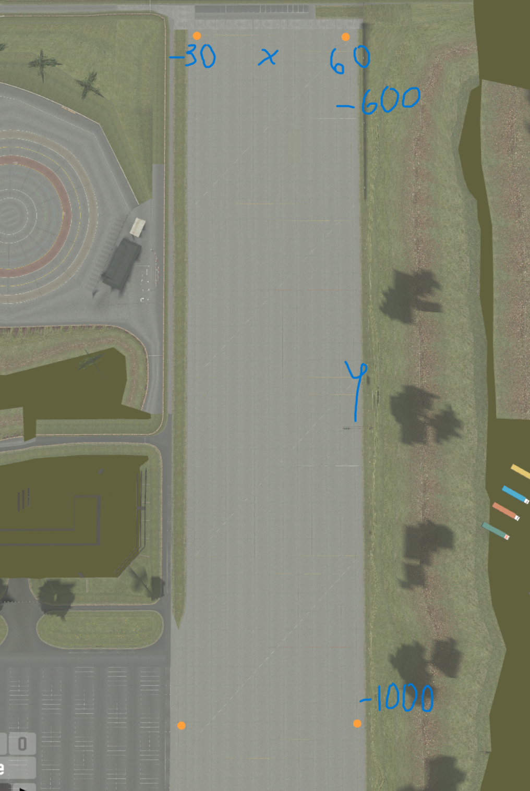

Live For Speed track encoder/decoder. Documentation https://www.lfs.net/programmer/lyt

Due to weird LFS variable format, there will always be precision loss for x, y, z and rotation.

Store tracks file in `G:\Games\Live for Speed\data\layout` folder. Sometimes LFS doesn't refresh the track so need to restart the game

### Activate virtual environment
Windows
```bash
.venv/Activate/Scripts
```

Linux/Mac
```bash
source .venv/Activate/bin
```

### Decode .lyt track file 
```bash
python track_decoder.py -i encoded_tracks/AU1_FG_2023_practise.lyt -o decoded_tracks/AU1_FG_2023_practise.json
```

### Encode json into .lyt track file
```bash
python track_encoder.py -i decoded_tracks/AU1_FG_2023_practise.json -o encoded_tracks/AU1_FG_2023_practise_2.lyt
```

To move entire track on x or y axis, use -x -y flags (default offset x=-30, y=-1000)
```bash
python track_encoder.py -i decoded_tracks/AU1_FG_2023_practise.json -o encoded_tracks/AU1_FG_2023_practise_2.lyt -x 10 -y 10
```

Overwrite to 0,0 if encoding/decoding existing track
```bash
python track_encoder.py -i decoded_tracks/AU1_FG_2023_practise.json -o encoded_tracks/AU1_FG_2023_practise_2.lyt -x 0 -y 0
```

### Important all .lyt track names must start with "AU1_"
"AU1_" tells the game which track to use as base. Then all objects added on top of that track.
```text
AU1_FG_2023_practise.lyt
AU1_FG2023_R1.lyt
AU1_LX_week3.lyt
```

### Headers are generated automatically
Example
```text
signature=b'LFSLYT' version=0 revision=252 num_added_objects=72 laps=1 flags=8
```

### Track coordinates x(-30; 60), y(-1000; -600)



### Track json example
```json
[
    {
        "position": {
            "x": 13.06,
            "y": -637.31,
            "z": 0.0
        },
        "rotation": -90.0,
        "type": "AXO_CHALK_LINE2"
    },
    {
        "position": {
            "x": -2.62,
            "y": -691.5,
            "z": 0.0
        },
        "rotation": -12.7,
        "type": "AXO_CONE_RED2"
    },
    {
        "position": {
            "x": -2.5,
            "y": -695.75,
            "z": 0.0
        },
        "rotation": -12.7,
        "type": "AXO_CONE_RED2"
    },
    {
        "position": {
            "x": 8.06,
            "y": -699.75,
            "z": 0.0
        },
        "rotation": -12.7,
        "type": "AXO_CONE_RED2"
    }
]
```
